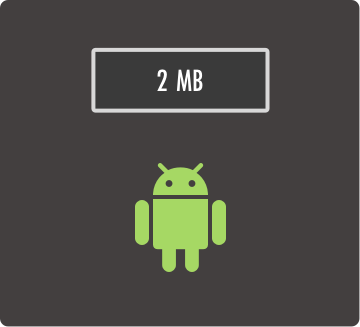

# Apkscale

[](https://circleci.com/gh/twilio/apkscale)

A Gradle plugin to measure the app size impact of Android libraries.



## Requirements

* Android SDK
* Apkscale can only be applied within a `com.android.library` project.
* [apkanalyzer](https://developer.android.com/studio/command-line/apkanalyzer) must be in your machine's path
* Android Gradle Plugin 4.0.0+

## Usage

[ ](https://bintray.com/twilio/releases/apkscale/_latestVersion)

Add the following to your project's buildscript section.

```groovy
buildscript {
    repositories {
        jcenter()
        maven { url 'https://repo.gradle.org/gradle/libs-releases' }
        // Include this line if you would like to use snapshots
        maven { url 'https://oss.jfrog.org/artifactory/libs-snapshot/' }
    }
    // Append -SNAPSHOT for snapshot versions
    classpath "com.twilio:apkscale:$apkscaleVersion"
}
```

Apply the plugin in your Android library project.

```groovy
apply plugin: 'com.android.library'
apply plugin: 'com.twilio.apkscale'

apkscale {
    // Optional parameter to provide size reports for each ABI in addition to the default universal ABI
    abis = ['x86', 'x86_64', 'armeabi-v7a', 'arm64-v8a']
}
```

Apkscale adds a `measureSize` task to your Android library module and, when run, scans the output directory of your library and measures the size of each .aar file present. Apkscale outputs the size report to a json file located at `<yourProjectBuildDir>/apkscale/build/outputs/reports/apkscale.json`. The json file contains an array of elements that provide a size report for each .aar file measured. Apkscale writes the size in a `--human-readable` as specified by [apkanalyzer](https://developer.android.com/studio/command-line/apkanalyzer). Reference the example below.

```json5
[
  {
    "library": "your-library-release.aar",
    "size": {
      // Included in all reports
      "universal": "21.9MB",

      // Included as specified by the abis parameter
      "x86": "6MB",
      "x86_64": "6.1MB",
      "armeabi-v7a": "4.8MB",
      "arm64-v8a": "5.7MB"
    }
  }
]
```

The following demonstrates how to read the Apkscale output and convert it to a markdown table.

```groovy
task generateSizeReport {
    dependsOn('measureSize')

    doLast {
        def sizeReport = "Size Report\n" +
                "\n" +
                "| ABI             | APK Size Impact |\n" +
                "| --------------- | --------------- |\n"
        def apkscaleOutputFile = file("$buildDir/apkscale/build/outputs/reports/apkscale.json")
        def jsonSlurper = new JsonSlurper()
        def apkscaleOutput = jsonSlurper.parseText(apkscaleOutputFile.text).get(0)

        apkscaleOutput.size.each { arch, sizeImpact ->
            videoAndroidSizeReport += "| ${arch.padRight(16)}| ${sizeImpact.padRight(16)}|\n"

        }
        println(sizeReport)
    }
}
```

## Development

Developing the plugin requires the Android SDK to be installed and `apkanalyzer` needs to be in your machine's path. The
project can be imported into Intellij IDEA CE as a Gradle project.

### Publishing to Maven Local

Reference the following snippet to publish the plugin to your local maven repository. Publishing to your local maven
repository can be useful when validating changes directly in an Android library project.

```shell
./gradlew publishApkscaleReleasePublicationToMavenLocal
```

### Implementation

Apkscale builds two flavors of a mock Android application: one without the library and one with the library included. Apkscale then uses the `apkanalyzer` diff operation to produce the size impact of the library.

## License

Apache 2.0 license. See [LICENSE](LICENSE) for details.
